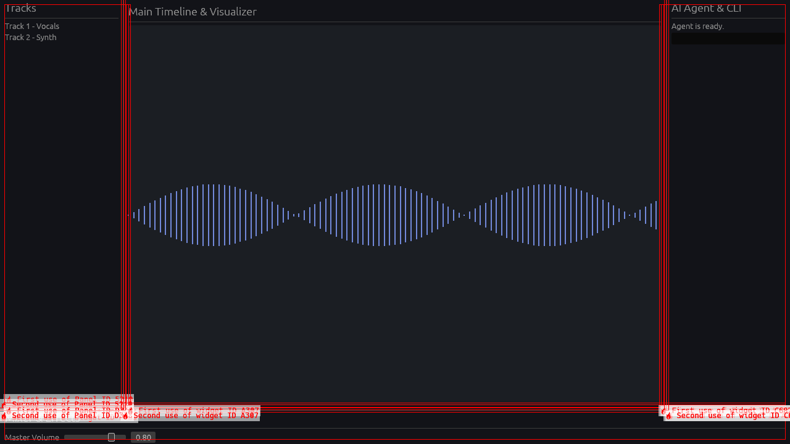

# Next-Gen AI DAW

This project is a Next-Gen AI DAW (Digital Audio Workstation) that combines traditional audio production tools with a modern, lightweight interface. It features AI agent integration and CLI control, adopting a Discord-inspired aesthetic with dynamic glassmorphism and animated lighting.

## Features
- **Standalone and Web App Capabilities**: A hybrid stack utilizing EGUI for high-performance audio visualizers and a modern web framework for the rest of the interface.
- **Glassmorphic UI**: Floating panels, frosted glass effects, and glowing accents.
- **AI Integration**: A dedicated AI agent/CLI panel for seamless control and workflow enhancement.
- **Modern Layout**: Familiar DAW features (timeline, mixer, plugins) redesigned for a futuristic feel.

## Screenshot

This screenshot shows the mockup UI implemented using Rust and `eframe`/`egui`. It features a left-side tracks panel, a right-side AI Agent interaction CLI, a bottom mixer and effects panel, and a central timeline/visualizer space using a dark glassmorphism aesthetic.
